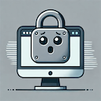

# Too Far; Didn't Lock
Automatically lock your computer when you leave it unattended.

Configure various conditions under which your computer should auto-lock:
* when a selected Bluetooth device goes out of range
* when a selected Bluetooth device fails to maintain an active connection
* [soon] when your computer leaves a specified network
* [soon] when a specified device is no longer on the same network as your computer
* [soon] configure by zones

# MacOS

[MacOS](MacOS/TooFarDidntLock)

# Windows
soon

# linux
on demand