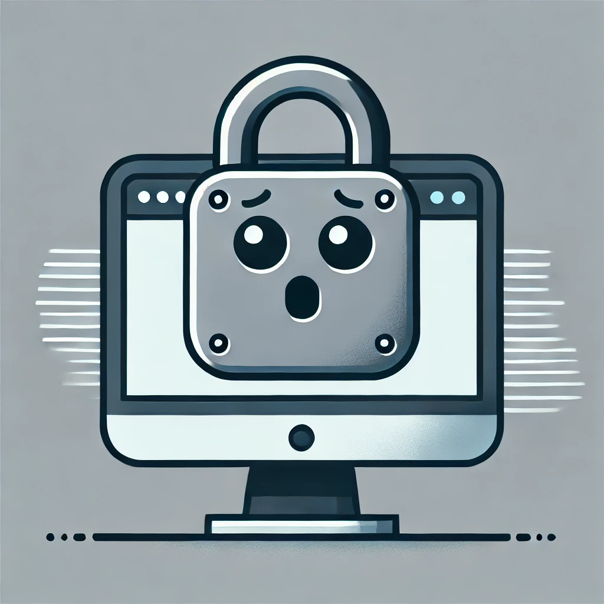

# Too Far; Didn't Lock
Automatically lock your Mac when you leave it unattended.

Configure various conditions under which your Mac should auto-lock:
* when a selected Bluetooth device goes out of range
* when a selected Bluetooth device fails to maintain an active connection
* [soon] when your Mac leaves a specified network
* [soon] when a specified device is no longer on the same network as your Mac
* [soon] configure by zones

# Documentation
TF;DL runs as a MacOS MenuBar app.

